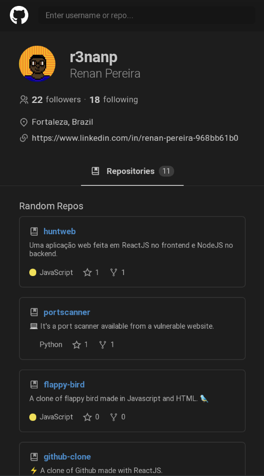
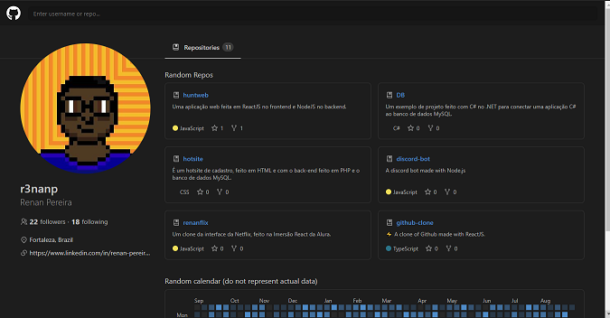

## github-clone
⚡ A clone of Github made with ReactJS.  

### Libraries used
* react-router-dom
* styled-components
* react-calendar-heatmap
* date-fns

### Link
[Website](https://r3nanp-github-clone.netlify.app/)

### Screenshots

